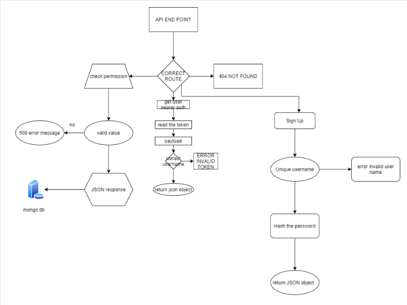

# auth-api

## Auther : Sukina Abu-Hmmad

### install

1. copy the link of the repo
2. clone the repo on your local machine 3. by git clone repo-url
3. download independencies by npm i
4. create a .env, then cope the content 6. of .env.sample file inside the .env 7. file.
5. fill the variables of .env
6. run the app

[test Report](https://github.com/Sukina12/auth-api/actions)

[deployment](https://sukina-auth-api.herokuapp.com/)

[pull request](https://github.com/Sukina12/auth-api/pull/1)

### Setup

PORT - port number
MONGODB_URL - port number
SECRET - a random string

### Test

- Unit test: npm run test
- Lint test: npm run lint

### UML

